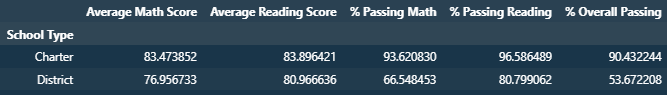

# School District Performance Analysis

This Python script analyzes the performance of a school district using data on student scores and school budgets. The jupyter notebook uses Pandas DataFrames to read, manipulate, and summarize the data.

## Data Files

This script uses two CSV files, which are stored in the `Resources` folder:

* `schools_complete.csv`: Contains information on each school in the district, including its name, type, and budget.
* `students_complete.csv`: Contains information on each student in the district, including their name, grade, and scores on math and reading exams.

## Data Analysis

The script performs the following analyses:

* District Summary: Calculates the total number of schools, total number of students, total budget, average math score, average reading score, percentage of students who passed math, percentage of students who passed reading, and percentage of students who passed both math and reading.

  
* School Summary: Calculates various metrics for each school in the district, including the average math and reading scores, percentage of students who passed math and reading, and total budget per student.

  
* Highest-Performing Schools: Lists the top-performing schools in the district based on the percentage of students who passed both math and reading.

  
* Bottom Performing Schools: Lists the bottom-performing schools in the district based on the percentage of students who passed both math and reading.

  
* Math Scores by Grade: Lists the average math score for each grade level (9th, 10th, 11th, and 12th) at each school in the district.

  
* Reading Scores by Grade: Lists the average reading score for each grade level (9th, 10th, 11th, and 12th) at each school in the district.

  
* Scores by School Spending: Groups the schools in the district into four spending ranges based on their budget per student, and calculates various metrics (e.g., average math score, percentage of students who passed math) for each spending range.

  
* Scores by School Size: Groups the schools in the district into three size categories (small, medium, and large) based on their total number of students, and calculates various metrics (e.g., average math score, percentage of students who passed math) for each size category.

  
* Scores by School Type: Calculates various metrics (e.g., average math score, percentage of students who passed math) for each school type (Charter vs. District) in the district.

  

Additional analysis notes and write-up can be found in the `PyCity Schools Analysis Summary.docx`

## Dependencies

This script requires the following Python packages:

* pandas

## How to Run

To run this script, open it in a Python environment (recommended: Jupyter Notebook) and execute the code cells one by one. The script assumes that the data files are located in the `Resources` folder relative to the jupyter notebook file.
